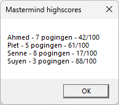

# Mastermind - PE 2

In deze korte uitbreiding gaan we ervoor zorgen dat de gebruiker een aantal zaken kan instellen. We gaan er dus voor zorgen dat een aantal zaken dynamisch worden.

- We gaan een menu toevoegen.
- Bij het starten van het spel gaan we naar de naam van de speler vragen.
- Het aantal maximaal toegelaten pogingen staat nu hardcoded op 10. We gaan ervoor zorgen dat dit dynamisch wordt.
- We gaan highscores bijhouden.

Gebruik de namen die voorzien zijn in de functionele vereisten, maar **zorg ervoor dat je de naming conventions hierop toepast**!

### Functionele vereisten

| ID | Onderwerp | Beschrijving |
| :--- | :--- | :--- |
| Mastermind-PE2-01 | Menu | Voeg een menu toe aan je applicatie: **Bestand &nbsp;&nbsp;&nbsp;&nbsp;&nbsp;Highscores** (toont de highscores van Mastermind-PE2-04) &nbsp;&nbsp;&nbsp;&nbsp;&nbsp;**Afsluiten** (sluit de applicatie) **Instellingen &nbsp;&nbsp;&nbsp;&nbsp;&nbsp;Aantal pogingen** (zie Mastermind-PE2-03)) |
| Mastermind-PE2-02 | Naam speler | Bij het starten van het spel gaan we naar de naam van de speler vragen. Zorg ervoor dat deze niet leeg kan zijn. *Tip: gebruik een InputBox en een DoWhile loop* |
| Mastermind-PE2-03 | Aantal pogingen | Het aantal maximaal toegelaten pogingen staat nu hardcoded op 10. We gaan ervoor zorgen dat dit dynamisch wordt door dit te laten ingeven door de gebruiker. Zorg ervoor dat dit tussen 3 en 20 ligt en dat er enkel getallen kunnen worden ingegeven. Pas je code ook aan dat het speleinde hiermee rekening houdt. |
| Mastermind-PE2-04 | Highscores | Telkens de speler het spel heeft beëindigd (code geraden of aantal pogingen bereikt) wordt de vraag gesteld om nog eens te spelen. Zorg dat je telkens de score bijhoudt in een overzicht van highscores. Maak hiervoor een string array *highscores* aan. In ***Mastermind-09 (Speleinde)*** heb je voorzien dat de applicatie sluit wanneer de speler niet wenst verder te spelen. Vooralleer dit gebeurt moet je de highscores tonen zoals in de screenshot te zien is.  |
